# Вклеиватель штрихкодов
Аугментатор, вклеивающий штрихкоды. Задача - создать алгоритм, принимающий на вход реальную картинку с баркодом и разметкой и вклеивать на его место другой (эталонный) баркод так, чтобы замена была не очень заметна.
Из внешних зависимостей в проекте используется только `OpenCV`
# API
На данный момент API представляет собой функцию с двумя возможными режимами работы:
```python
class Mode(Enum):
    # In this mode seamless_replace won't try to adjust color schemes of barcodes
    NO_AUTOCOLOR = 0
    # Automatically adjust colors of barcodes
    AUTOCOLOR = 1


def seamless_replace(
    base_image, base_polygon, new_image, new_polygon, mode=Mode.AUTOCOLOR
):
    """
    Replaces barcode on base_image with a barcode on new_image.
    For now, base_polygon and new_polygon should have exactly 4 vertices!
    It's better for new_image to be without noise, shadows, etc.
    (i.e. new_image should be synthetic, model etc.)


    Args:
        base_image (ndarray): The source image (BGR format).
        base_polygon (ndarray): Quadrilateral defining the area of original barcode.
        new_image (ndarray): Image with new barcode (BGR format).
        new_polygon (ndarray): Quadrilateral defining the area of new barcode.
        mode (Mode): The mode of seamless_replace (NO_AUTOCOLOR/AUTOCOLOR for now)

    Returns:
        ndarray: Image of barcode from new_image pasted onto base_image
    """
```
Где `base_image` и `new_image` - изображения в формате `OpenCV`.\
В текущей реализации ожидается, что `base_polygon` и `new_polygon` - контуры баркодов (согласно [принятому](https://github.com/CD7567/mipt2024f-4-common-knowledge/blob/master/annotation/annotation.md) подходу к разметке), при том **четырехугольники** (будет обосновано далее). Также функция имеет два режима работы - `AUTOCOLOR` и `NO_AUTOCOLOR`. При первом режиме алгоритм предварительно будет пытаться определить цветовую схему баркода на `base_image` и применить ее к баркоду на `new_image`. `NO_AUTOCOLOR` отключает данную функцию. Основное правило выбора режима - если вы вклеиваете эталонный баркод (`new_image`) (т.е. синтезированный), то следует отдавать предпочтение `AUTOCOLOR`. Если вклеиваемый баркод также является реальной картинкой, то следует использовать `NO_AUTOCOLOR`.\
В текущем API разметка полученного изображения не возвращается, так как она совпадает с `base_polygon`

# Вклеивание баркода

Библиотека `OpenCV` предоставляет функцию `cv2.seamlessClone`, предназначенную для создания композиции из двух изоображений, интегрируя часть (согласно маске) одного изображения на другое, плавно вклеивая выбранный регион. Алгоритм работает на основе [Poisson Image Editing](https://www.cs.jhu.edu/~misha/Fall07/Papers/Perez03.pdf), в основе которого лежит "подстраивание" градиентов нового изображения к исходному.

- Данная функция во многом выполняет большую часть работы, но ей нужно помогать:
Цветовые схемы баркодов могут быть различными (не только ч/б) (см. картинку ниже), что препятствует качественной замене с `cv2.seamlessClone`. Поэтому по возможности стоит менять цветовую схему вклеиваемого эталона на схему оригинала (т.е. нужно уметь определять цвета фона и штрихов на реальной картинке).

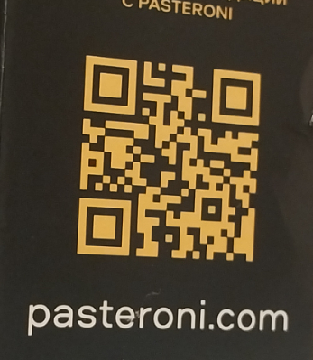

- Нужно "подложить" новый баркод на то же место, где находится старый. В целом эта задача напоминает ректификацию (обратную) - нужно "исказить" новый баркод, согласно искажению оригинального баркода. В целом для решения этой подзадачи можно использовать "обратимый" ректификатор, применив его преобразования в обратную сторону. Но на данный момент происходит просто преобразование перспективы нового баркода к перспективе старого. Для вычисления перспективы необходим **четырехугольник**, ограничивающий баркод. Именно из этого вытекает ограничение на число вершин в контуре. В целом, можно пытаться сводить полигон к четырехугольнику с помощью `cv2.approxPolyDP`, но по сути эта функция уже "предполагает", что полигон "почти" четырехугольник. (А `cv2.minAreaRect` не подходит, т.к. забывает информацию о перспективе, создавая прямоугольник). Так как нечетырехугольная разметка почти всегда говорит о том, что изображение требует ректификации, было решено просто работать только с четырехугольными контура.
- Также есть другие особенности реальной картинки, влияющие на качество результата `cv2.seamlessClone`: наличие размытия, бликов, шумов и тд. Пока эти проблемы не решены, но почти все из них неплохо нивелируются самим `cv2.seamlessClone` (размытие влияет сильнее всего). Ниже приведено изображение с результатом работы вклеивателя на размытом баркоде


<br><br><br>

В результате был разработан алгоритм с следующими шагами:

1. Замена цветовой гаммы на эталоне (функция `details.correct_colors`). Для начала находятся части картинки, относящиеся к фону баркода (background) и части, содержащие штрихи (foreground) - это делается с помощью `cv2.threshold` в режиме метода Оцу. Далее берется среднее по пикселям каждой части - получаем цвета background и foreground. Далее (аналогичным образом) эти цвета применяются к изображению с эталоном. Именно тут необходимо требовать "эталонность". Иначе метод Оцу плохо отличит части, принадлежащие фону от фронта (из-за теней, шумов, артефактов и т.д.) - это не сильно влияет на определение цветов на реальной картинке (так как в среднем метод Оцу разделит на нужные части), но критично для этапа перекрашивания нового баркода (так как он может быть перекрашен частично/неправильно, если не является синтетическим).
Поэтому этот шаг выполняется только в режиме `AUTOCOLOR`. Если новый баркод не эталон или же на исходном изображении очень много артефактов, что цвета плохо определяются - стоит попробовать `NO_AUTOCOLOR`. При этом применение `AUTOCOLOR` c эталонами показало очень хорошие результаты.

2. Преобразование перспективы нового баркода к перспективе старого с помощью `cv2.getPerspectiveTransform` и `cv2.WarpPerspective`

3. Для более аккуратного, плавного вклеивания и компенсации недочетов разметки (например, обрезается часть баркода) создается маска (на основе `base_polygon`), которая затем чутка расширяется и размывается с помощью `cv2.dilate` и `cv2.GaussianBlur`. Параметры ядер для этих функций определяются исходя из размеров `base_polygon` с коэффициентами, выбранными эмпирически (возможно стоит также предоставить возможность их выбирать пользователю (опционально))

4. Непосредственно применение `cv2.seamlessClone`

# Полученные результаты и тестирование
Скрипт `main.py` проходится по размеченному датасету вклеивает на каждый из размеченных регионов синтетические баркоды из соответствующей директории (т.е. для каждого региона на картинке будет произведена вклейка и сохранена в отдельную картинку)

```
python3 ./main.py

- -d, --data: Optional. The path to the directory with data (data/ by default)
- -s, --synthetic: Optional. The path to the directory with synthetic barcode for replacement (synthetic/ by default)
- -o, --output: Optional. The to the directory where to save results (output/ by default)
- --no-autocolor: Optional. Tells program to use NO_AUTOCOLOR mode for replacement (by default AUTOCOLOR is used)
```

В директории `output_autocolor/` находятся результаты с режимом `AUTOCOLOR`. В директории `output_no_autocolor/` - для режима `NO_AUTOCOLOR`. В директории `synthetic/` - сгенерированные эталоны, использованные для вклеивания (директория имеет структуру `synthetic/code_type/`). Итоговые картинки записываются под именем `{имя_эталона}_on_{имя_оригинала}_{region_id}.jpg`
Стоит отметить, что применение `AUTOCOLOR` с эталонами дало более реалистичные результаты. В целом алгоритм дает очень реалистичные изображения, в редких случаях чутка смешивая цвета (в результате `cv2.seamlessClone`), иногда могут "съезжать" удлиненные штрихи у `ean-13`, также не очень хорошо вклеивается на размытые картинки. Ниже приведены примеры работы в формате до/после.

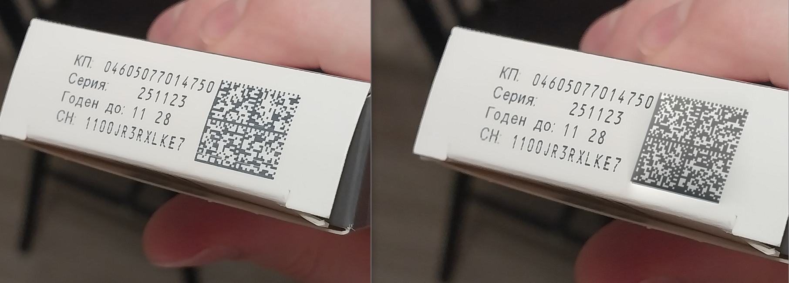\
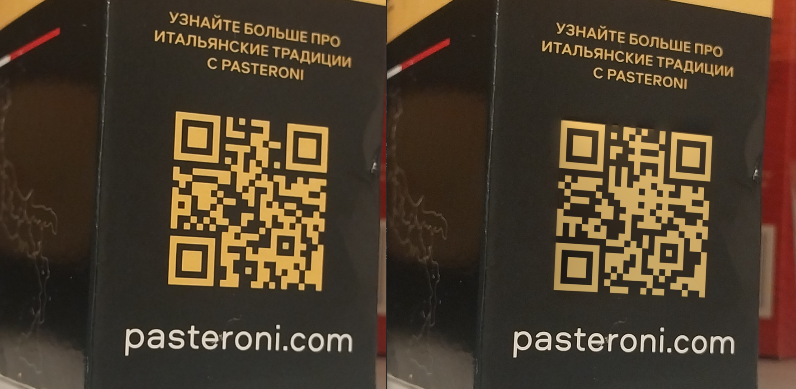\
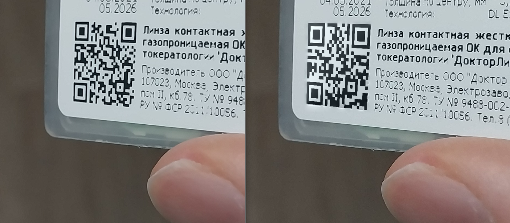\
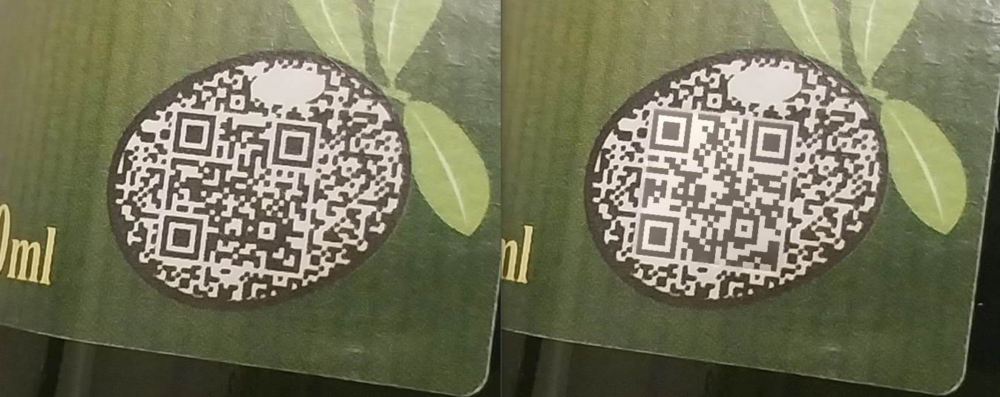\
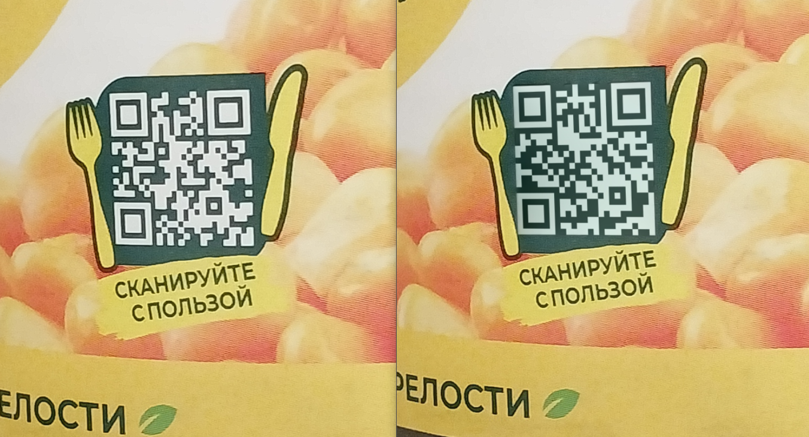\
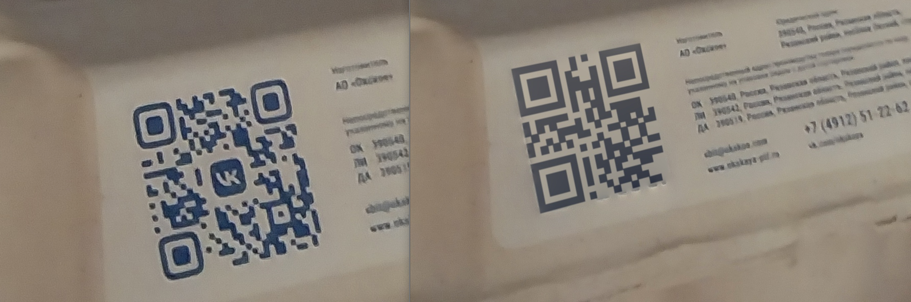\
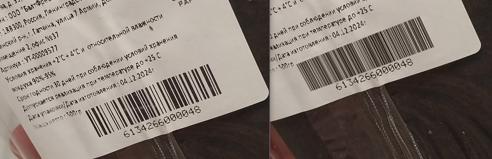\
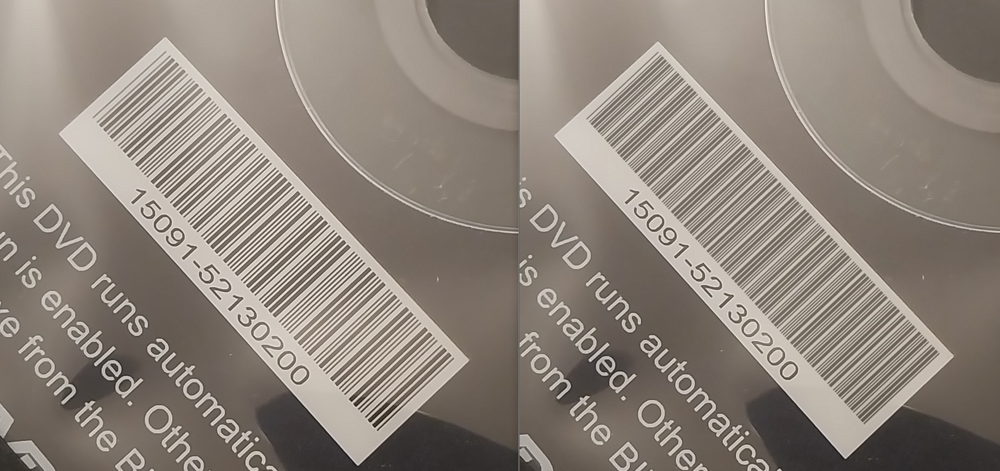\
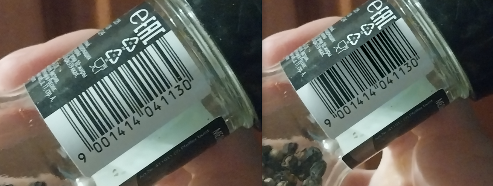

# Текущие проблемы

Пока в качестве метрики используется лишь визуальный осмотр. В качестве метрики предлагается реализовать Structural Similarity Index Measure (SSIM) (сравнивать с помощью него вклеенную область с его окружением). Также можно измерять разницу в цветах между оригиналом и полученным изображением.

Из проблем в самом алгоритме стоит выделить не самые хорошие результаты для `ean-13` (с подписью снизу) - для него плохо сопоставляются "хвосты" и иногда немного "смывается" расшифровка снизу. В качестве решения можно расширять разметку вниз, и вклеивать баркод вместе с расшифровкой и удлиненными концами (но для этого нужно научится определять, есть ли у данного кода подпись снизу, либо сделать это параметром алгоритма)
| 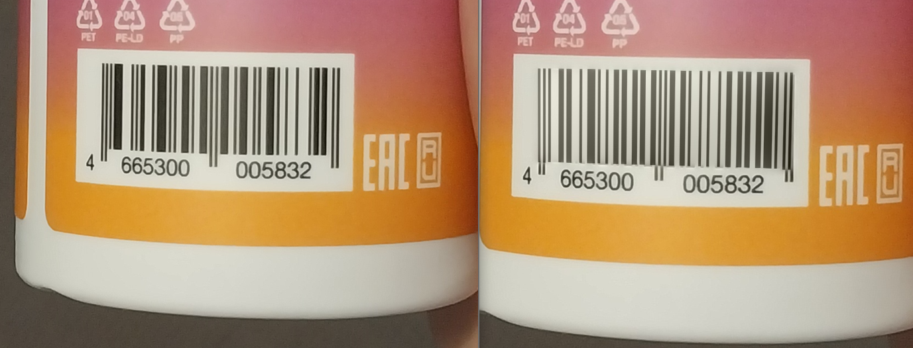 | 
|:--:| 
| Проблемный ean-13 |

Также стоит улучшить обработку размытия - предлагается предварительно применять размытие к эталону, выбрав параметры размытия исходя из оригинальной картинки (сделав это еще одним флагом `AUTOBLUR`).
|  | 
|:--:| 
| Очень выделяются картинки с размытием |

Также отмечу неидеальную работу определения цветовой схемы на приведенном ниже изображении (хотя сам результат вклейки вышел неплохим, несмотря на неверные цвета). Ошибка, вероятно связана с наличием блика в правом верхнем углу и относительной "похожестью" цветов (в результате алгоритм неправильно определил, где фон, а где фронт).
| 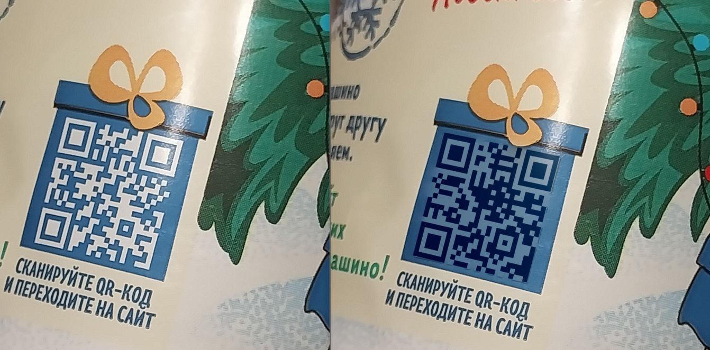 | 
|:--:| 
| Поломалась цветовая схема (зато вклеилось хорошо) |

# Размеченные данные
На текущий момент было размечено 52 картинки, содержащие `ean-13`, `ean-128`, `code-39`, `qr` и `data-matrix` (директория `data/`)